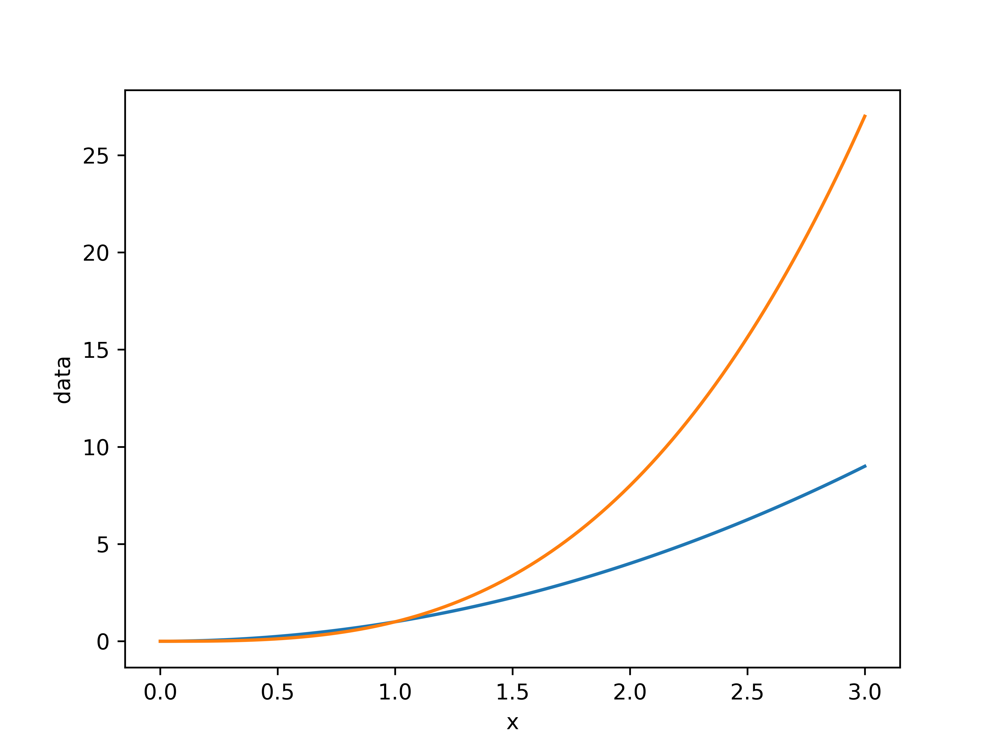

# pyplot-cli

Lightweight cli tool for plotting data. Currently, only line plot is supported.

## Release note

- `0.1.0` (2021.08.15): Initialized!

## Usage

- Basic: `pyplt [filename] -x [x_index] -y [y_indices]`
  - The form `-y`: index1,index2,...
- result:

    

- more options: `--xlabel`, `--ylabel`, ... see `pyplt --help` for all options.
